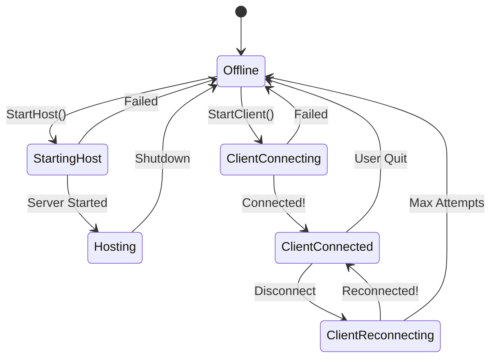

# 10: Connection State Machine Deep Dive

> **Purpose:** A comprehensive guide to the connection management system—how Boss Room handles hosting, joining, disconnecting, and reconnecting. This is essential knowledge for any multiplayer game.

---

## Table of Contents

1. [Why a State Machine?](#why-a-state-machine)
2. [Architecture Overview](#architecture-overview)
3. [All Connection States](#all-connection-states)
4. [State Transition Diagram](#state-transition-diagram)
5. [ConnectionManager Deep Dive](#connectionmanager-deep-dive)
6. [Each State Explained](#each-state-explained)
7. [Connection Approval Flow](#connection-approval-flow)
8. [Strategy Pattern: ConnectionMethod](#strategy-pattern-connectionmethod)
9. [Reconnection System](#reconnection-system)
10. [Key Takeaways](#key-takeaways)

---

## Why a State Machine?

Multiplayer connection has many states: offline, connecting, connected, hosting, reconnecting, etc. Without a state machine, you end up with:

```csharp
// BAD: Spaghetti code without state machine
void OnDisconnect()
{
    if (isHost) { ... }
    else if (wasConnecting) { ... }
    else if (shouldReconnect && attempts < maxAttempts) { ... }
    else if (userRequestedDisconnect) { ... }
    // Gets worse and worse...
}
```

With a state machine:

```csharp
// GOOD: Each state handles its own logic
class ClientReconnectingState : ConnectionState
{
    public override void OnClientDisconnect(ulong clientId)
    {
        // Only reconnection logic here!
        if (m_NbAttempts < maxAttempts)
            StartReconnect();
        else
            ChangeState(m_Offline);
    }
}
```

**Benefits:**
- Clear understanding of what's possible in each state
- Easy to add new states without breaking existing code
- Each state is self-contained and testable
- Impossible to be in illegal state combinations

---

## Architecture Overview

```
┌─────────────────────────────────────────────────────────────────────────────┐
│                        CONNECTION MANAGEMENT SYSTEM                          │
└─────────────────────────────────────────────────────────────────────────────┘

┌──────────────────────────────────────────────────────────────────────────────┐
│  CONNECTION MANAGER (MonoBehaviour)                                          │
│  ┌──────────────────────────────────────────────────────────────────────────┐│
│  │                                                                          ││
│  │  ┌─────────────┐    Routes to     ┌─────────────────────┐               ││
│  │  │  NetworkMgr │ ──────────────►  │   Current State     │               ││
│  │  │  Callbacks  │                  │   (ConnectionState) │               ││
│  │  └─────────────┘                  └─────────────────────┘               ││
│  │                                             │                           ││
│  │  State Instances (pre-created):             │ ChangeState()             ││
│  │  ┌─────────────┐ ┌─────────────┐           │                           ││
│  │  │  Offline    │ │ Connecting  │           ▼                           ││
│  │  └─────────────┘ └─────────────┘  ┌─────────────────────┐               ││
│  │  ┌─────────────┐ ┌─────────────┐  │   New State         │               ││
│  │  │  Hosting    │ │ Reconnecting│  │   .Enter()          │               ││
│  │  └─────────────┘ └─────────────┘  └─────────────────────┘               ││
│  │                                                                          ││
│  └──────────────────────────────────────────────────────────────────────────┘│
└──────────────────────────────────────────────────────────────────────────────┘

┌──────────────────────────────────────────────────────────────────────────────┐
│  CONNECTION METHOD (Strategy Pattern)                                        │
│  ┌─────────────────────┐    ┌─────────────────────┐                         │
│  │  ConnectionMethodIP │    │ ConnectionMethodRelay│                         │
│  │  (Direct LAN)       │    │ (Unity Relay Service)│                         │
│  └─────────────────────┘    └─────────────────────┘                         │
└──────────────────────────────────────────────────────────────────────────────┘
```

### Key Files

| File | Purpose | Lines |
|------|---------|-------|
| [ConnectionManager.cs](file:///d:/unity_projects/com.unity.multiplayer.samples.coop/Assets/Scripts/ConnectionManagement/ConnectionManager.cs) | State machine controller | ~183 |
| [ConnectionState.cs](file:///d:/unity_projects/com.unity.multiplayer.samples.coop/Assets/Scripts/ConnectionManagement/ConnectionState/ConnectionState.cs) | Base state class | ~46 |
| [OfflineState.cs](file:///d:/unity_projects/com.unity.multiplayer.samples.coop/Assets/Scripts/ConnectionManagement/ConnectionState/OfflineState.cs) | Initial/disconnected state | ~66 |
| [HostingState.cs](file:///d:/unity_projects/com.unity.multiplayer.samples.coop/Assets/Scripts/ConnectionManagement/ConnectionState/HostingState.cs) | Active host state | ~165 |
| [ClientReconnectingState.cs](file:///d:/unity_projects/com.unity.multiplayer.samples.coop/Assets/Scripts/ConnectionManagement/ConnectionState/ClientReconnectingState.cs) | Attempting reconnect | ~141 |
| [ConnectionMethod.cs](file:///d:/unity_projects/com.unity.multiplayer.samples.coop/Assets/Scripts/ConnectionManagement/ConnectionMethod.cs) | IP vs Relay strategies | ~168 |

---

## All Connection States

| State | When Active | Key Responsibility |
|-------|-------------|---------------------|
| **OfflineState** | No network connection | Entry point for host/join |
| **StartingHostState** | Host startup in progress | Setup relay, start NetworkManager |
| **HostingState** | Actively hosting | Approve connections, manage players |
| **ClientConnectingState** | Client joining | Setup connection, start NetworkManager |
| **ClientConnectedState** | Successfully connected | Handle disconnect gracefully |
| **ClientReconnectingState** | Lost connection, trying again | Retry with backoff |

---

## State Transition Diagram



### Text Diagram (for environments without Mermaid)

```
                              ┌──────────────┐
                              │   OFFLINE    │◄────────────────────────┐
                              └──────┬───────┘                         │
                                     │                                 │
              ┌──────────────────────┼──────────────────────┐          │
              │ StartHost()          │          StartClient() │         │
              ▼                      │                      ▼          │
    ┌─────────────────┐              │          ┌────────────────────┐ │
    │  STARTING HOST  │              │          │ CLIENT CONNECTING  │ │
    └────────┬────────┘              │          └─────────┬──────────┘ │
             │                       │                    │            │
    Success  │  Fail ────────────────┼────────────────────┤ Fail ──────┤
             ▼                       │                    ▼            │
    ┌─────────────────┐              │          ┌────────────────────┐ │
    │    HOSTING      │──Shutdown────┘          │ CLIENT CONNECTED   │ │
    └─────────────────┘                         └─────────┬──────────┘ │
                                                          │            │
                                               Disconnect │  User Quit │
                                                          ▼            │
                                                ┌────────────────────┐ │
                                                │CLIENT RECONNECTING │──┘
                                                └────────────────────┘
                                                    │           │
                                                Success     Max Attempts
                                                    │           │
                                                    ▼           │
                                       Back to ClientConnected ─┘
```

---

## ConnectionManager Deep Dive

The `ConnectionManager` is the orchestrator. It holds all state instances and routes NetworkManager callbacks to the current state.

**File:** [ConnectionManager.cs](file:///d:/unity_projects/com.unity.multiplayer.samples.coop/Assets/Scripts/ConnectionManagement/ConnectionManager.cs)

### ConnectStatus Enum

```csharp
public enum ConnectStatus
{
    Undefined,
    Success,                  // Connection successful
    ServerFull,               // Can't join, server at capacity
    LoggedInAgain,            // Logged in elsewhere, kicked
    UserRequestedDisconnect,  // User intentionally disconnected
    GenericDisconnect,        // Unknown disconnect reason
    Reconnecting,             // Attempting to reconnect
    IncompatibleBuildType,    // Build version mismatch
    HostEndedSession,         // Host shut down the game
    StartHostFailed,          // Failed to start server
    StartClientFailed         // Failed to connect to server
}
```

### State Instance Pre-Creation

```csharp
// States are created ONCE upfront, not on demand
internal readonly OfflineState m_Offline = new OfflineState();
internal readonly ClientConnectingState m_ClientConnecting = new ClientConnectingState();
internal readonly ClientConnectedState m_ClientConnected = new ClientConnectedState();
internal readonly ClientReconnectingState m_ClientReconnecting = new ClientReconnectingState();
internal readonly StartingHostState m_StartingHost = new StartingHostState();
internal readonly HostingState m_Hosting = new HostingState();
```

**Why pre-create states?**
- Avoids garbage collection during gameplay
- States can be configured before use
- Dependencies injected once in Start()

### Dependency Injection Setup

```csharp
void Start()
{
    // Inject dependencies into all states
    List<ConnectionState> states = new() {
        m_Offline, m_ClientConnecting, m_ClientConnected,
        m_ClientReconnecting, m_StartingHost, m_Hosting
    };
    foreach (var connectionState in states)
    {
        m_Resolver.Inject(connectionState);  // VContainer DI
    }
    
    // Start in offline state
    m_CurrentState = m_Offline;
    
    // Subscribe to NetworkManager events
    NetworkManager.OnConnectionEvent += OnConnectionEvent;
    NetworkManager.OnServerStarted += OnServerStarted;
    NetworkManager.ConnectionApprovalCallback += ApprovalCheck;
    NetworkManager.OnTransportFailure += OnTransportFailure;
    NetworkManager.OnServerStopped += OnServerStopped;
}
```

### State Transition

```csharp
internal void ChangeState(ConnectionState nextState)
{
    Debug.Log($"Changed connection state from {m_CurrentState.GetType().Name} " +
              $"to {nextState.GetType().Name}.");
    
    // Exit current state
    if (m_CurrentState != null)
    {
        m_CurrentState.Exit();
    }
    
    // Enter new state
    m_CurrentState = nextState;
    m_CurrentState.Enter();
}
```

### Event Routing

All NetworkManager callbacks are routed to the current state:

```csharp
void OnConnectionEvent(NetworkManager networkManager, ConnectionEventData data)
{
    switch (data.EventType)
    {
        case ConnectionEvent.ClientConnected:
            m_CurrentState.OnClientConnected(data.ClientId);
            break;
        case ConnectionEvent.ClientDisconnected:
            m_CurrentState.OnClientDisconnect(data.ClientId);
            break;
    }
}

void ApprovalCheck(ConnectionApprovalRequest request, ConnectionApprovalResponse response)
{
    m_CurrentState.ApprovalCheck(request, response);
}
```

---

## Each State Explained

### OfflineState

**File:** [OfflineState.cs](file:///d:/unity_projects/com.unity.multiplayer.samples.coop/Assets/Scripts/ConnectionManagement/ConnectionState/OfflineState.cs)

The entry point. Handles the transition from "no connection" to "attempting connection."

```csharp
class OfflineState : ConnectionState
{
    public override void Enter()
    {
        // Clean up from previous session
        m_MultiplayerServicesFacade.EndTracking();
        m_ConnectionManager.NetworkManager.Shutdown();
        
        // Load main menu
        if (SceneManager.GetActiveScene().name != "MainMenu")
        {
            SceneLoaderWrapper.Instance.LoadScene("MainMenu", useNetworkSceneManager: false);
        }
    }
    
    public override void StartClientIP(string playerName, string ipaddress, int port)
    {
        // Create connection method (IP strategy)
        var connectionMethod = new ConnectionMethodIP(
            ipaddress, (ushort)port, m_ConnectionManager, m_ProfileManager, playerName);
        
        // Configure reconnecting state to use same method
        m_ConnectionManager.m_ClientReconnecting.Configure(connectionMethod);
        
        // Transition to connecting
        m_ConnectionManager.ChangeState(
            m_ConnectionManager.m_ClientConnecting.Configure(connectionMethod));
    }
    
    public override void StartHostSession(string playerName)
    {
        // Create connection method (Relay strategy)
        var connectionMethod = new ConnectionMethodRelay(
            m_MultiplayerServicesFacade, m_ConnectionManager, m_ProfileManager, playerName);
        
        // Transition to starting host
        m_ConnectionManager.ChangeState(
            m_ConnectionManager.m_StartingHost.Configure(connectionMethod));
    }
}
```

### HostingState

**File:** [HostingState.cs](file:///d:/unity_projects/com.unity.multiplayer.samples.coop/Assets/Scripts/ConnectionManagement/ConnectionState/HostingState.cs)

The most complex state. Handles incoming connections, validates players, and manages the session.

```csharp
class HostingState : OnlineState
{
    const int k_MaxConnectPayload = 1024;  // DOS protection
    
    public override void Enter()
    {
        // Load character select scene (game-specific)
        SceneLoaderWrapper.Instance.LoadScene("CharSelect", useNetworkSceneManager: true);
        
        // Start session tracking if using Unity services
        if (m_MultiplayerServicesFacade.CurrentUnitySession != null)
        {
            m_MultiplayerServicesFacade.BeginTracking();
        }
    }
    
    public override void OnClientConnected(ulong clientId)
    {
        var playerData = SessionManager<SessionPlayerData>.Instance.GetPlayerData(clientId);
        if (playerData != null)
        {
            // Publish success event
            m_ConnectionEventPublisher.Publish(new ConnectionEventMessage() {
                ConnectStatus = ConnectStatus.Success,
                PlayerName = playerData.Value.PlayerName
            });
        }
        else
        {
            // This shouldn't happen, kick the player
            Debug.LogError($"No player data associated with client {clientId}");
            m_ConnectionManager.NetworkManager.DisconnectClient(clientId, 
                JsonUtility.ToJson(ConnectStatus.GenericDisconnect));
        }
    }
    
    public override void OnUserRequestedShutdown()
    {
        // Kick all other players with reason
        var reason = JsonUtility.ToJson(ConnectStatus.HostEndedSession);
        var clientIds = m_ConnectionManager.NetworkManager.ConnectedClientsIds;
        
        for (var i = clientIds.Count - 1; i >= 0; i--)
        {
            var id = clientIds[i];
            if (id != m_ConnectionManager.NetworkManager.LocalClientId)
            {
                m_ConnectionManager.NetworkManager.DisconnectClient(id, reason);
            }
        }
        
        m_ConnectionManager.ChangeState(m_ConnectionManager.m_Offline);
    }
}
```

### ClientReconnectingState

**File:** [ClientReconnectingState.cs](file:///d:/unity_projects/com.unity.multiplayer.samples.coop/Assets/Scripts/ConnectionManagement/ConnectionState/ClientReconnectingState.cs)

Handles automatic reconnection with configurable attempts and delays.

```csharp
class ClientReconnectingState : ClientConnectingState
{
    int m_NbAttempts;
    
    const float k_TimeBeforeFirstAttempt = 1f;
    const float k_TimeBetweenAttempts = 5f;
    
    public override void Enter()
    {
        m_NbAttempts = 0;
        m_ReconnectCoroutine = m_ConnectionManager.StartCoroutine(ReconnectCoroutine());
    }
    
    public override void OnClientDisconnect(ulong _)
    {
        var disconnectReason = m_ConnectionManager.NetworkManager.DisconnectReason;
        
        if (m_NbAttempts < m_ConnectionManager.NbReconnectAttempts)
        {
            // Check if we should try again based on reason
            if (string.IsNullOrEmpty(disconnectReason))
            {
                // Unknown reason, try again
                StartCoroutine(ReconnectCoroutine());
            }
            else
            {
                var connectStatus = JsonUtility.FromJson<ConnectStatus>(disconnectReason);
                
                switch (connectStatus)
                {
                    // Don't retry for these reasons
                    case ConnectStatus.UserRequestedDisconnect:
                    case ConnectStatus.HostEndedSession:
                    case ConnectStatus.ServerFull:
                    case ConnectStatus.IncompatibleBuildType:
                        m_ConnectionManager.ChangeState(m_ConnectionManager.m_Offline);
                        break;
                    
                    // Retry for other reasons
                    default:
                        StartCoroutine(ReconnectCoroutine());
                        break;
                }
            }
        }
        else
        {
            // Max attempts reached, give up
            m_ConnectionManager.ChangeState(m_ConnectionManager.m_Offline);
        }
    }
}
```

---

## Connection Approval Flow

When a client tries to connect, the host validates them using `ApprovalCheck`.

**File:** [HostingState.cs](file:///d:/unity_projects/com.unity.multiplayer.samples.coop/Assets/Scripts/ConnectionManagement/ConnectionState/HostingState.cs) (lines 111-146)

```csharp
public override void ApprovalCheck(
    NetworkManager.ConnectionApprovalRequest request,
    NetworkManager.ConnectionApprovalResponse response)
{
    var connectionData = request.Payload;
    var clientId = request.ClientNetworkId;
    
    // 1. DOS Protection: Reject oversized payloads
    if (connectionData.Length > k_MaxConnectPayload)
    {
        response.Approved = false;
        return;
    }
    
    // 2. Parse connection payload
    var payload = System.Text.Encoding.UTF8.GetString(connectionData);
    var connectionPayload = JsonUtility.FromJson<ConnectionPayload>(payload);
    
    // 3. Run validation checks
    var gameReturnStatus = GetConnectStatus(connectionPayload);
    
    if (gameReturnStatus == ConnectStatus.Success)
    {
        // 4. Set up player data
        SessionManager<SessionPlayerData>.Instance.SetupConnectingPlayerSessionData(
            clientId, connectionPayload.playerId,
            new SessionPlayerData(clientId, connectionPayload.playerName, ...));
        
        // 5. Approve connection
        response.Approved = true;
        response.CreatePlayerObject = true;
        response.Position = Vector3.zero;
        response.Rotation = Quaternion.identity;
    }
    else
    {
        // 6. Reject with reason
        response.Approved = false;
        response.Reason = JsonUtility.ToJson(gameReturnStatus);
    }
}

ConnectStatus GetConnectStatus(ConnectionPayload connectionPayload)
{
    // Check 1: Server full?
    if (NetworkManager.ConnectedClientsIds.Count >= MaxConnectedPlayers)
    {
        return ConnectStatus.ServerFull;
    }
    
    // Check 2: Build type mismatch?
    if (connectionPayload.isDebug != Debug.isDebugBuild)
    {
        return ConnectStatus.IncompatibleBuildType;
    }
    
    // Check 3: Already connected from another device?
    return SessionManager.IsDuplicateConnection(connectionPayload.playerId)
        ? ConnectStatus.LoggedInAgain
        : ConnectStatus.Success;
}
```

### Approval Flow Diagram

```
Client sends connection request
            │
            ▼
┌───────────────────────────────┐
│ Payload size > 1024 bytes?    │
│     │ Yes                 No  │
│     ▼                     │   │
│  REJECT                   │   │
│  (DOS protection)         │   │
└───────────────────────────┼───┘
                            │
                            ▼
┌───────────────────────────────┐
│ Server full? (>= MaxPlayers)  │
│     │ Yes                 No  │
│     ▼                     │   │
│  REJECT                   │   │
│  "ServerFull"             │   │
└───────────────────────────┼───┘
                            │
                            ▼
┌───────────────────────────────┐
│ Build type matches?           │
│     │ No                  Yes │
│     ▼                     │   │
│  REJECT                   │   │
│  "IncompatibleBuildType"  │   │
└───────────────────────────┼───┘
                            │
                            ▼
┌───────────────────────────────┐
│ Already connected elsewhere?  │
│     │ Yes                 No  │
│     ▼                     │   │
│  REJECT                   │   │
│  "LoggedInAgain"          │   │
└───────────────────────────┼───┘
                            │
                            ▼
                    ┌───────────────┐
                    │    APPROVE    │
                    │  Create player│
                    │    object     │
                    └───────────────┘
```

---

## Strategy Pattern: ConnectionMethod

The project supports multiple ways to connect: direct IP and Unity Relay. This is implemented using the **Strategy Pattern**.

**File:** [ConnectionMethod.cs](file:///d:/unity_projects/com.unity.multiplayer.samples.coop/Assets/Scripts/ConnectionManagement/ConnectionMethod.cs)

### Base Class

```csharp
public abstract class ConnectionMethodBase
{
    protected ConnectionManager m_ConnectionManager;
    protected readonly string m_PlayerName;
    
    // Setup before starting NetworkManager as host
    public abstract void SetupHostConnection();
    
    // Setup before starting NetworkManager as client
    public abstract void SetupClientConnection();
    
    // Setup for reconnection attempt
    public abstract Task<(bool success, bool shouldTryAgain)> SetupClientReconnectionAsync();
    
    // Create connection payload
    protected void SetConnectionPayload(string playerId, string playerName)
    {
        var payload = JsonUtility.ToJson(new ConnectionPayload
        {
            playerId = playerId,
            playerName = playerName,
            isDebug = Debug.isDebugBuild
        });
        
        var payloadBytes = System.Text.Encoding.UTF8.GetBytes(payload);
        m_ConnectionManager.NetworkManager.NetworkConfig.ConnectionData = payloadBytes;
    }
}
```

### IP Connection (LAN)

```csharp
class ConnectionMethodIP : ConnectionMethodBase
{
    string m_Ipaddress;
    ushort m_Port;
    
    public override void SetupClientConnection()
    {
        SetConnectionPayload(GetPlayerId(), m_PlayerName);
        
        // Configure transport with IP/port
        var utp = (UnityTransport)m_ConnectionManager.NetworkManager
            .NetworkConfig.NetworkTransport;
        utp.SetConnectionData(m_Ipaddress, m_Port);
    }
    
    public override void SetupHostConnection()
    {
        // Host is also a client, needs payload too
        SetConnectionPayload(GetPlayerId(), m_PlayerName);
        
        var utp = (UnityTransport)m_ConnectionManager.NetworkManager
            .NetworkConfig.NetworkTransport;
        utp.SetConnectionData(m_Ipaddress, m_Port);
    }
    
    public override Task<(bool success, bool shouldTryAgain)> SetupClientReconnectionAsync()
    {
        // IP reconnection is simple - just try again
        return Task.FromResult((true, true));
    }
}
```

### Relay Connection (Internet)

```csharp
class ConnectionMethodRelay : ConnectionMethodBase
{
    MultiplayerServicesFacade m_MultiplayerServicesFacade;
    
    public override void SetupClientConnection()
    {
        SetConnectionPayload(GetPlayerId(), m_PlayerName);
        // Relay is already configured by the session join process
    }
    
    public override async Task<(bool success, bool shouldTryAgain)> SetupClientReconnectionAsync()
    {
        // Check if session still exists
        if (m_MultiplayerServicesFacade.CurrentUnitySession == null)
        {
            Debug.Log("Session does not exist anymore, stopping reconnection.");
            return (false, false);  // Don't try again
        }
        
        // Try to reconnect to the session
        var session = await m_MultiplayerServicesFacade.ReconnectToSessionAsync();
        var success = session != null;
        
        Debug.Log(success ? "Successfully reconnected to Session." : "Failed to reconnect.");
        return (success, true);  // Try again if failed
    }
}
```

### When to Use Each

| Method | Use When | Pros | Cons |
|--------|----------|------|------|
| **IP** | LAN parties, local testing | Simple, no services needed | Requires port forwarding for internet |
| **Relay** | Internet play | Works through NAT | Requires Unity services |

---

## Reconnection System

The reconnection system handles temporary network issues gracefully.

**File:** [ClientReconnectingState.cs](file:///d:/unity_projects/com.unity.multiplayer.samples.coop/Assets/Scripts/ConnectionManagement/ConnectionState/ClientReconnectingState.cs)

### Reconnection Coroutine

```csharp
IEnumerator ReconnectCoroutine()
{
    // 1. Wait between attempts (not on first attempt)
    if (m_NbAttempts > 0)
    {
        yield return new WaitForSeconds(k_TimeBetweenAttempts);  // 5 seconds
    }
    
    Debug.Log("Lost connection to host, trying to reconnect...");
    
    // 2. Shutdown NetworkManager cleanly
    m_ConnectionManager.NetworkManager.Shutdown();
    yield return new WaitWhile(() => 
        m_ConnectionManager.NetworkManager.ShutdownInProgress);
    
    Debug.Log($"Reconnecting attempt {m_NbAttempts + 1}/{MaxAttempts}...");
    
    // 3. Publish UI message
    m_ReconnectMessagePublisher.Publish(
        new ReconnectMessage(m_NbAttempts, MaxAttempts));
    
    // 4. Wait before first attempt (give services time to update)
    if (m_NbAttempts == 0)
    {
        yield return new WaitForSeconds(k_TimeBeforeFirstAttempt);  // 1 second
    }
    
    m_NbAttempts++;
    
    // 5. Setup reconnection (different for IP vs Relay)
    var reconnectTask = m_ConnectionMethod.SetupClientReconnectionAsync();
    yield return new WaitUntil(() => reconnectTask.IsCompleted);
    
    // 6. Try to connect
    if (!reconnectTask.IsFaulted && reconnectTask.Result.success)
    {
        ConnectClientAsync();  // Will trigger OnClientConnected or OnClientDisconnect
    }
    else
    {
        if (!reconnectTask.Result.shouldTryAgain)
        {
            // Don't try again (e.g., session doesn't exist)
            m_NbAttempts = MaxAttempts;
        }
        OnClientDisconnect(0);  // Trigger retry or give up
    }
}
```

### Reconnection Timeline

```
Connection Lost
      │
      ▼
┌─────────────────┐
│ Attempt 1       │
│ Wait 1 second   │ ◄─── First attempt delay (services update)
│ Try to connect  │
└────────┬────────┘
         │ Failed
         ▼
┌─────────────────┐
│ Attempt 2       │
│ Wait 5 seconds  │ ◄─── Delay between attempts
│ Try to connect  │
└────────┬────────┘
         │ Failed
         ▼
┌─────────────────┐
│ Attempt 3       │
│ Wait 5 seconds  │
│ Try to connect  │
└────────┬────────┘
         │ Failed
         ▼
┌─────────────────┐
│ Give Up         │
│ → OfflineState  │
└─────────────────┘
```

---

## Key Takeaways

### Design Patterns Used

| Pattern | Implementation |
|---------|----------------|
| **State Machine** | ConnectionState classes with Enter/Exit |
| **Strategy** | ConnectionMethodIP vs ConnectionMethodRelay |
| **Dependency Injection** | VContainer injects into states |
| **Observer** | PubSub for connection events |

### Core Principles

1. **State Encapsulation:** Each state handles its own logic
2. **Pre-created States:** Avoid garbage collection
3. **Event Routing:** ConnectionManager routes callbacks to current state
4. **Graceful Reconnection:** Automatic retry with configurable attempts
5. **Validation on Host:** Server approval prevents unauthorized access

### Adding a New Connection Method

To add a new way to connect (e.g., Steam networking):

```csharp
class ConnectionMethodSteam : ConnectionMethodBase
{
    public override void SetupHostConnection()
    {
        // Configure Steam networking
    }
    
    public override void SetupClientConnection()
    {
        // Join via Steam lobby
    }
    
    public override Task<(bool success, bool shouldTryAgain)> SetupClientReconnectionAsync()
    {
        // Check Steam lobby status
    }
}
```

### Adding a New Connection State

To add a new state (e.g., matchmaking):

```csharp
class MatchmakingState : ConnectionState
{
    public override void Enter()
    {
        // Start matchmaking request
    }
    
    public override void Exit()
    {
        // Cancel matchmaking if in progress
    }
    
    public void OnMatchFound(MatchInfo match)
    {
        // Configure connection method
        // Transition to ClientConnecting
    }
}
```

---

## Exercises

1. **Trace Host Flow:** Follow the code from "Host" button click to CharSelect scene load. What states are entered?

2. **Add Validation:** Modify HostingState.GetConnectStatus() to reject players with inappropriate names.

3. **Custom Reconnection:** Implement exponential backoff (1s, 2s, 4s, 8s) instead of fixed 5s delay.

4. **Find the Strategy:** Why does ConnectionMethodRelay not configure the transport in SetupClientConnection()?

---

> **Next:** [11_infrastructure_patterns.md](./11_infrastructure_patterns.md) — PubSub, Object Pools, and more
