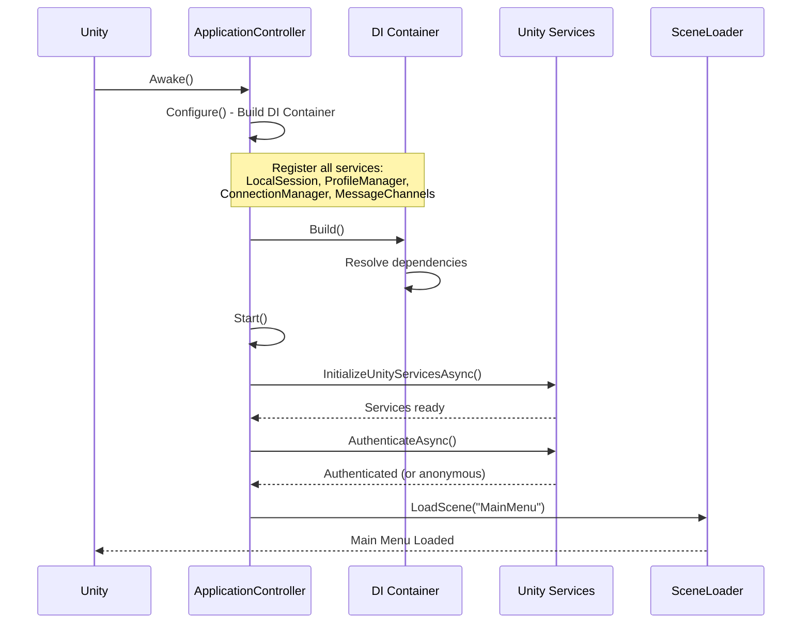
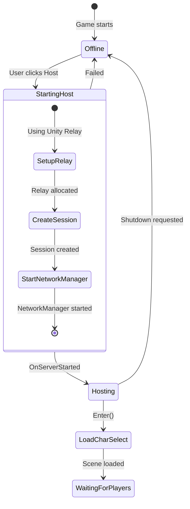
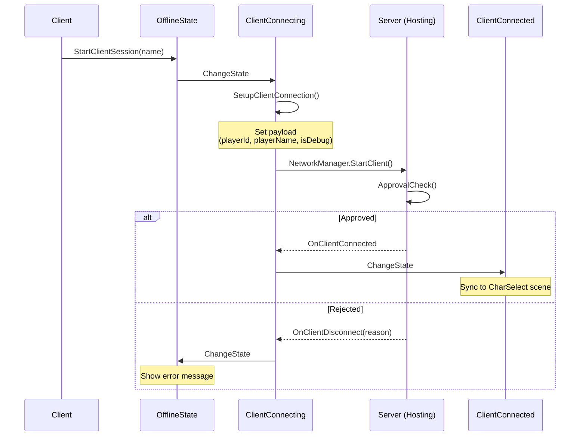
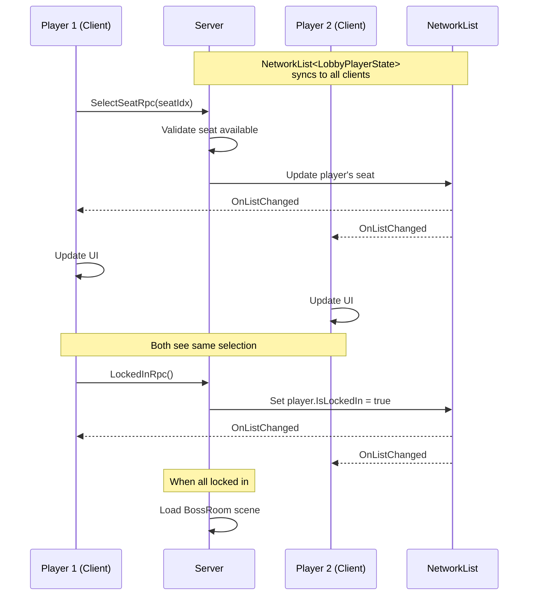
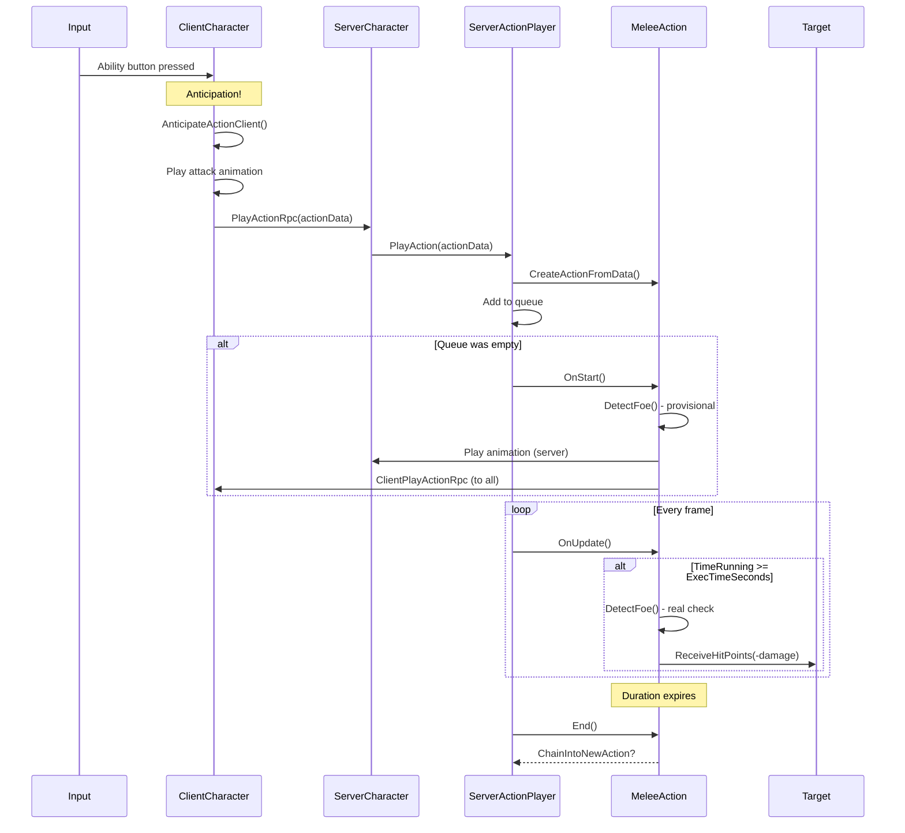
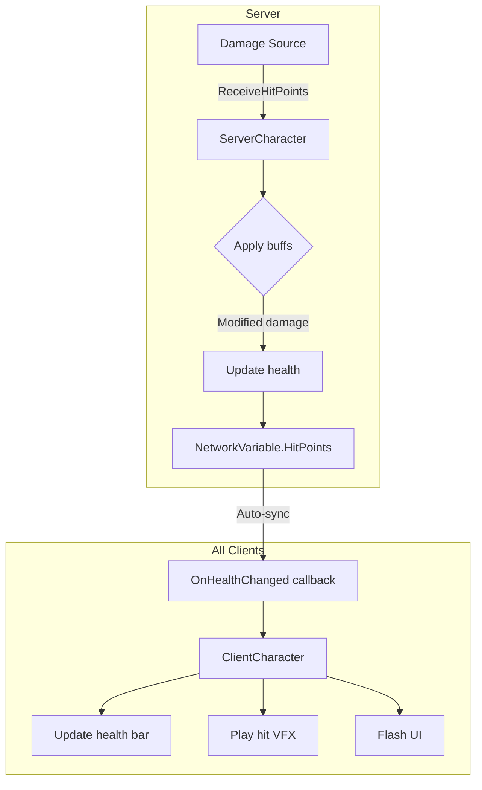
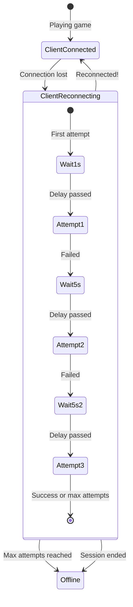

# 12: System Flow Diagrams

> **Purpose:** Visual reference showing how the major systems work. Use these diagrams when you need to quickly understand a flow or when debugging.

---

## Table of Contents

1. [Game Startup Sequence](#game-startup-sequence)
2. [Host Connection Flow](#host-connection-flow)
3. [Client Connection Flow](#client-connection-flow)
4. [Character Selection Sync](#character-selection-sync)
5. [Combat Action Flow](#combat-action-flow)
6. [Health Damage Flow](#health-damage-flow)
7. [Reconnection Flow](#reconnection-flow)

---

## Game Startup Sequence

What happens from Unity launch to the main menu appearing.



### Text Diagram

```
Unity Launch
     │
     ▼
┌─────────────────────────────────────┐
│  ApplicationController.Awake()      │
│  └─ DontDestroyOnLoad               │
└─────────────────┬───────────────────┘
                  │
                  ▼
┌─────────────────────────────────────┐
│  Configure() - DI Container Setup   │
│  ├─ Register LocalSession           │
│  ├─ Register ProfileManager         │
│  ├─ Register ConnectionManager      │
│  ├─ Register MessageChannels        │
│  └─ Register UnityServices Facades  │
└─────────────────┬───────────────────┘
                  │
                  ▼
┌─────────────────────────────────────┐
│  Start()                            │
│  ├─ Initialize Unity Services       │
│  ├─ Authenticate (anonymous OK)     │
│  └─ Load Main Menu Scene            │
└─────────────────┬───────────────────┘
                  │
                  ▼
         [ Main Menu Ready ]
```

---

## Host Connection Flow

What happens when a player clicks "Host Game."



### Detailed Steps

```
User clicks "Host"
        │
        ▼
┌──────────────────────────────────────────────┐
│  OfflineState.StartHostSession()             │
│  ├─ Create ConnectionMethodRelay             │
│  └─ ChangeState(StartingHost)                │
└──────────────────────┬───────────────────────┘
                       │
                       ▼
┌──────────────────────────────────────────────┐
│  StartingHostState.Enter()                   │
│  ├─ SetupHostConnection()                    │
│  │   ├─ Set connection payload               │
│  │   └─ Configure transport (Relay or IP)   │
│  └─ NetworkManager.StartHost()               │
└──────────────────────┬───────────────────────┘
                       │
        ┌──────────────┴──────────────┐
        │                             │
    Success                        Failure
        │                             │
        ▼                             ▼
┌───────────────────┐        ┌───────────────────┐
│ OnServerStarted() │        │ OnTransportFailure│
│ ChangeState       │        │ ChangeState       │
│   (Hosting)       │        │   (Offline)       │
└────────┬──────────┘        └───────────────────┘
         │
         ▼
┌──────────────────────────────────────────────┐
│  HostingState.Enter()                        │
│  ├─ LoadScene("CharSelect", network: true)   │
│  └─ BeginTracking() if using Session         │
└──────────────────────────────────────────────┘
```

---

## Client Connection Flow

What happens when a player joins a game.



### Approval Checks

```
Client connection request arrives
              │
              ▼
┌───────────────────────────────────────────────┐
│  HostingState.ApprovalCheck()                 │
└────────────────────┬──────────────────────────┘
                     │
                     ▼
        ┌────────────────────────┐
        │ Payload > 1024 bytes?  │
        └────────┬───────────────┘
                 │ No
                 ▼
        ┌────────────────────────┐
        │ Server full?           │
        │ (count >= MaxPlayers)  │
        └────────┬───────────────┘
                 │ No
                 ▼
        ┌────────────────────────┐
        │ Build type mismatch?   │
        │ (Debug vs Release)     │
        └────────┬───────────────┘
                 │ No
                 ▼
        ┌────────────────────────┐
        │ Duplicate connection?  │
        │ (same playerId)        │
        └────────┬───────────────┘
                 │ No
                 ▼
        ┌────────────────────────┐
        │       APPROVED         │
        │  CreatePlayerObject    │
        └────────────────────────┘
```

---

## Character Selection Sync

How character selection stays synchronized across all players.



### Key Insight: Client Never Modifies Directly

```
┌─────────────────────────────────────────────────────────────────┐
│                                                                 │
│  ❌ WRONG: Client modifies local state, hopes it syncs         │
│  ✅ RIGHT: Client sends RPC, server validates, NetworkList     │
│            automatically syncs to everyone                      │
│                                                                 │
└─────────────────────────────────────────────────────────────────┘

Client clicks character
        │
        ▼
┌─────────────────────┐
│ Send RPC to server  │ ◄── Client does NOT update local state yet
└─────────┬───────────┘
          │
          ▼ (travels over network)
          
┌─────────────────────┐
│ Server validates    │
│ ├─ Is seat taken?   │
│ ├─ Is player valid? │
│ └─ etc.             │
└─────────┬───────────┘
          │ If valid
          ▼
┌─────────────────────┐
│ Server updates      │
│ NetworkList         │
└─────────┬───────────┘
          │
          ▼ (auto-syncs)
          
┌─────────────────────┐
│ ALL clients receive │ ◄── NOW client updates local state
│ OnListChanged       │
└─────────────────────┘
```

---

## Combat Action Flow

Complete flow from player input to damage applied.



### Timeline View

```
T+0ms:     Player presses attack button
           │
           ├─► Client: AnticipateActionClient()
           │   └─ Animation starts IMMEDIATELY (feels responsive!)
           │
           └─► RPC sent to server
           
T+50ms:    Server receives RPC
           │
           ├─► ServerActionPlayer.PlayAction()
           ├─► MeleeAction.OnStart()
           │   ├─ DetectFoe() → provisional target
           │   ├─ Snap to face target
           │   └─ Send ClientPlayActionRpc to all clients
           │
           └─► Action added to queue, starts running

T+100ms:   Other clients receive ClientPlayActionRpc
           └─► OnStartClient() → spawn VFX on target

T+400ms:   TimeRunning >= ExecTimeSeconds (e.g., 0.4s)
           │
           └─► MeleeAction.OnUpdate()
               ├─ DetectFoe() → real hit check
               └─ Target.ReceiveHitPoints(-25)
                  │
                  └─► NetworkVariable<HitPoints> syncs to all clients

T+450ms:   All clients see health bar update

T+1000ms:  TimeRunning >= DurationSeconds (e.g., 1.0s)
           │
           └─► Action ends
               ├─ MeleeAction.End()
               ├─ ServerActionPlayer.AdvanceQueue()
               └─ Next action starts (if any)
```

---

## Health Damage Flow

From damage received to UI update on all clients.



### Code Flow

```
ServerCharacter.ReceiveHP(source, -damage)
        │
        ▼
┌─────────────────────────────────────────────────┐
│  1. Notify active actions (might modify damage) │
│     serverActionPlayer.OnGameplayActivity(     │
│         GameplayActivity.AttackedByEnemy)      │
└─────────────────────┬───────────────────────────┘
                      │
                      ▼
┌─────────────────────────────────────────────────┐
│  2. Apply buff modifiers                        │
│     float modifier = serverActionPlayer        │
│         .GetBuffedValue(PercentDamageReceived) │
│     finalDamage = damage * modifier            │
└─────────────────────┬───────────────────────────┘
                      │
                      ▼
┌─────────────────────────────────────────────────┐
│  3. Apply damage to NetworkVariable            │
│     m_NetworkHealthState.HitPoints.Value       │
│         += finalDamage                         │
└─────────────────────┬───────────────────────────┘
                      │
                      ▼
┌─────────────────────────────────────────────────┐
│  4. Check death                                │
│     if (HitPoints <= 0)                        │
│         m_NetworkLifeState.LifeState.Value     │
│             = LifeStateType.Fainted            │
└─────────────────────┬───────────────────────────┘
                      │
                      │ (NetworkVariable syncs automatically)
                      │
                      ▼
┌─────────────────────────────────────────────────┐
│  All Clients: OnValueChanged callback          │
│  ├─ ClientCharacter receives callback          │
│  ├─ Update health bar UI                       │
│  ├─ Play damage VFX                            │
│  └─ Trigger hit react animation                │
└─────────────────────────────────────────────────┘
```

---

## Reconnection Flow

What happens when a client loses connection.



### Decision Logic

```
Connection Lost
      │
      ▼
┌───────────────────────────────────────┐
│  Enter ClientReconnectingState        │
│  m_NbAttempts = 0                     │
│  Start ReconnectCoroutine()           │
└──────────────────┬────────────────────┘
                   │
                   ▼
         ┌─────────────────┐
         │ First attempt?  │
         └────────┬────────┘
                  │
        ┌─────────┴─────────┐
       Yes                  No
        │                   │
        ▼                   ▼
   Wait 1 second      Wait 5 seconds
        │                   │
        └─────────┬─────────┘
                  │
                  ▼
┌───────────────────────────────────────┐
│  SetupClientReconnectionAsync()       │
│  (differs by connection method)       │
└──────────────────┬────────────────────┘
                   │
        ┌──────────┴──────────┐
     Success               Failed
        │                     │
        ▼                     ▼
┌─────────────────┐  ┌─────────────────────┐
│ ConnectClient() │  │ attempts < max?     │
└────────┬────────┘  └──────────┬──────────┘
         │                      │
         │             ┌────────┴────────┐
         │            Yes               No
         │             │                 │
         │             ▼                 ▼
         │        Try again        Go to Offline
         │             │
         │             └─────────────────┐
         │                               │
         ▼                               │
┌─────────────────┐                      │
│ OnClient        │                      │
│ Connected?      │                      │
└────────┬────────┘                      │
         │                               │
    ┌────┴────┐                          │
   Yes        No                         │
    │         │                          │
    ▼         └──────────────────────────┘
Go to ClientConnected
```

---

## Quick Reference Card

### State Transitions

| From | Event | To |
|------|-------|-----|
| Offline | StartHost | StartingHost |
| Offline | StartClient | ClientConnecting |
| StartingHost | Server started | Hosting |
| StartingHost | Failed | Offline |
| Hosting | Shutdown | Offline |
| ClientConnecting | Connected | ClientConnected |
| ClientConnecting | Failed | Offline |
| ClientConnected | Disconnect | ClientReconnecting |
| ClientConnected | User quit | Offline |
| ClientReconnecting | Connected | ClientConnected |
| ClientReconnecting | Max attempts | Offline |

### Action Lifecycle

| Phase | Server Method | Client Method |
|-------|--------------|---------------|
| Anticipation | — | AnticipateActionClient |
| Start | OnStart | OnStartClient |
| Update | OnUpdate | OnUpdateClient |
| End | End | EndClient |
| Cancel | Cancel | CancelClient |

---

> **Next:** [13_code_reading_walkthroughs.md](./13_code_reading_walkthroughs.md) — Guided exercises to read the code yourself
